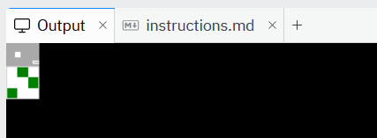

# Lab 7 - Lists and references

## Overview 

This lab exercises your knowledge of the concepts up to module 7 in CSD110. You will practice using lists in Python programs, including multi-dimensional lists, and working with references. 

## Required Reading 

It is assumed that you have watched all lecture videos and completed readings and practice exercises up to the end of Chapter 10 (not including Chapter 4) in the course textbook.  If you have not done so yet, you should! 

##  Instructions 

### Running your code

In the `main.py` file you will see several lines of code that import the individual code files you will work on in this lab. You can manage which files run when you click the `Run` button by commenting all imports except the one you want to run. (And you can of course run multiple of your code files by leaving multiple lines uncommented.)

### Testing your code

A set of tests have been prepared for this lab that will help you determine if your code is correct or not. To run the tests...

1. Open the Shell (in the right side panel)
2. Run the command `python -m pytest .test/test_q#.py` (with the `#` replaced by the number of the code file you want to test). You can also run all the tests for the lab at once by running the command `python -m pytest .test`

The output of the tests will give you an indication of how many of the tests passed or failed. For any failed tests, you will also see error messages that should help you determine why the test failed. 

If all the tests passed, you can be reasonably sure that your code is correct, **BUT PASSING ALL TESTS DOES NOT NECESSARILY MEAN YOU WILL GET 100%** because some grades are assigned to non-coding tasks, and it is sometimes possible to create incorrect programs that do pass the tests.

### Other important notes

In any place where you are responsible for naming functions or variables, you MUST use meaningful names. You must also include appropriate docstrings for any non-trivial functions you create. Failing to do so will result in a lower grade.

### Part 1 - Experimenting with lists and references

Spend some time in a Python REPL experimenting with list values until you feel comfortable that you understand the working of the the following. Be investigative! Ask yourself "what happens if...?" questions and write code that explores those questions to answer them to your satisfaction.

- Create lists that contain various types of values
- Use the split function to create a list from a string
- Use the join function to create a string out of a list
- Index and slice a list to obtain specific items and sub-lists in the list
- Re-assign elements of a list
- Create multi-dimensional lists
- Retrieve specific values from multi-dimensional lists
- Use a list comprehension to build one list out of another

1. Copy your REPL session and paste it into `q1.txt`

### Part 2 - Building 2-dimensional lists

In `q2.py`...

1. Create a **PURE** function named `make_times_table`
2. It must have a single parameter
    1. You may state as a precondition that the parameter must be an integer
3. It returns the empty list if n < 0
2. It uses **loops** and the `append` method to return a 2-dimensional list representing the times table for the given integer.  That is, the value at position `i,j` in the table is `i x j`

    > **Examples:** 
    > ```python
    > make_times_table(0)  # Returns: [ [0] ]
    > make_times_table(1)  # Returns: [ [0, 0], [0, 1] ]
    > make_times_table(2)  # Returns: [ [0, 0, 0], [0, 1, 2], [0, 2, 4] ]
    
### Part 3 - Conway's game of life

In this part, you will complete an implementation of [Conway's Game of Life](https://en.wikipedia.org/wiki/Conway%27s_Game_of_Life). An incomplete implementation has been provided that initializes a graphics library named `tkinter` such that a basic window is drawn with a grid of 9 cells. You will complete the missing parts of the program so that it can animate a game of arbitrary size and starting state.

#### Familiarize yourself with the game

Read through the introduction and "Rules" sections of the [Conway's Game of Life Wikipedia article](https://en.wikipedia.org/wiki/Conway%27s_Game_of_Life), and skim the rest of it.

Try playing [this online implementation](https://playgameoflife.com/) of the game. Your implementation will be much simpler, showing only the evolving grid and none of the other controls, but this will give you an idea of the expected behaviour.

**Bonus**: Did you notice the note in the Wikipedia article stating that Life is Turing Complete? Remember, that means that you can use the Game of Life to write programs.  Does that mean that you can write Conway's Game of Life using Conway's Game of Life?  [Yes! Yes it does!](https://oimo.io/works/life/) (Load that link, then zoom out, then keep zooming out, then clean up the pieces of your exploding mind 🤯)

#### Familiarize yourself with the given code

In the `conway` folder are a number of files with code already made for you. Below is a description of those files.

**NOTE:** Unless otherwise state, the only file you will need to make changes in is `q3.py`

- `__init__.py` — This file is necessary to make the import statements work in this lab. That's all you need to know, but if you're interested in learning more, see [this documentation](https://docs.python.org/3/reference/import.html#regular-packages).
- `app.py` — The starting point of the application. You can run the game by importing the app module in `main.py` using `import conway.app as app` and then calling `app.start()`
- `config.py` — Defines several variables with values that you can change if you want to effect some aspects of the game
- `q3.py` — Defines the three functions you will need to complete. Each function has been given a basic (incorrect) implementation, enough to have the program run before you have made your own changes.
- `ui.py` — The code that sets up the user interface using the `tkinter` module. When first running the app, you will be able to view the interface in the Output tab in the right panel of Replit. You should see something like the image below:

     

- `world.py` — To make it simpler to set an initial world configuration, the multi-line string defined in this file is used. A `.` represents an empty space in the grid; a `*` represents a living cell.  The `get_world_str` function should be used to retrieve this string, as it will do some validation to ensure the string is properly formatted.

#### Understand the key data structure

It is a very common feature of computer programs to have some set of data structures on which the rest of the program operates to perform its task. The key data structure used in this program is a 2d list that represents the game world. Every frame of the game is drawn based on the contents of this 2d list. 

Locate in `q3.py` the initial list returned from the `get_world()` function: `[['.', '*', '.'], ['.', '.', '*'], ['*', '.', '.']]`

Let's format that list in a way that will make the structure easier to understand:

```python
[
  ['.', '*', '.'], 
  ['.', '.', '*'], 
  ['*', '.', '.']
]
```

Can you see how this corresponds to the the initial output you see when first running the program? (See the screenshot above.)  The white squares correspond to the positions in the list where the `.`s are, and the green squares to the positions where the `*`s are.

You will have to complete 3 functions in this part of the lab:

1. `get_world()` — Produce a list like the one above from a string like the one in `world.py`
2. `count_live_neighbours()` — Given a list like the one above, and specific position in the list, count the number of items in the 8 positions around that position that have living cells (`*`) in them
3. `evolve()` — Given a list like the one above, produce another list that represents the state of the game after applying the rules of Conway's Game of Life

See the sections below for more detailed instructions.

#### Part 3a - Analyze some code

Read through the `ui.py` code and try to get a sense of what it does.
Add your answers to the questions below in comments in the indicated section at the top of `q3.py`

1. Find the lines where the width and height of the windows are calculated. Explain why `len(world[0])` and `len(world)` represent the width and height of the world, respectively.
3. Find the nested `for` loop in the `draw_world` function. Explain why
   
   ```python
   x += config.cell_size
   ```
   must be in the inner loop, but
   
   ```python
   y += config.cell_size
   ```
   
   must be in the outer loop.
1. The comments have already indicated that `ui.init` is a higher-order function because it accepts as an argument another function. Find another example of a higher-order function inside the `ui` module, and explain why it is one.

#### Part 3b - Build a 2d list (implement `get_world()`)

Currently the `get_world()` function returns a hard-coded list.

1. Change `get_world()` so that it builds the 2d list corresponding to the string returned from `get_world_string()`. Once you have completed this step, you should be able to control the graphical output of the app by changing the world string in `world.py`

    **HINT:** The [splitlines](https://docs.python.org/3/library/stdtypes.html#str.splitlines) method on Python string objects should come in handy!

**CHALLENGE:** It is possible to build this list using a single list comprehension expression. Can you figure it out?

#### Part 3c - Navigating a 2d list (implement `count_live_neighbours()`)

In the list representing the state of the game, a 'neighbour' of a given position is one of the 8 positions around that position.  For example, in the world below there is one live cell, and its 8 neighbours are labeled `n`.

```
.....
.nnn.
.n*n.
.nnn.
.....
```

If a live cell is at an edge of the world, it may have less than 8 neighbours. For example, in the world below there are two live cells: the one in the corner has only 3 neighbours and the one at the edge has 5:

```
*n...
nn...
...nn
...n*
...nn
```


Currently the `count_live_neighbours()` function always returns 0. 

1. Change the body of the function so that it returns the number of **LIVE** neighbours of the given position.

   **HINT:** There are at least two correct approaches to solving this: 1) a set of condition statements that checks each of the 8 neighbouring positions in turn, adding to a count as needed, or 2) create a list of the coordinates of the neighbouring positions (a list of `[x,y]` lists), then traverse this list and check each coordinate in turn.  In both strategies, you will need to also check whether each neighbouring position is outside the edge of the world in order to avoid getting 'out of bounds' runtime errors.

#### Part 3d - Processing a list (complete `evolve()`)

Currently the `evolve()` function simply returns the same world, so the world never changes.

1. Change the body of the function so that it returns a new list with the rules of the Game of Life applied as described in the function's docstring.

    **HINT:** The `count_live_neighbours()` function you just wrote should be most useful! You will need to check what the value of each list item is (one of `.` or `*`), compare that with the number of live neighbours, then add to the new list either `.` or `*` depending on which rule needs to be applied.

## Submission

1. **Be sure to test your code using the testing instructions above!**
2. Review your code and make sure that it is well organized, commented, and that **all your functions have appropriate docstrings**
3. Copy the URL for this lab from your address bar
4. Submit this URL in the appropriate lab folder on the LMS

## Rubric

See the rubric attached to this lab in the LMS